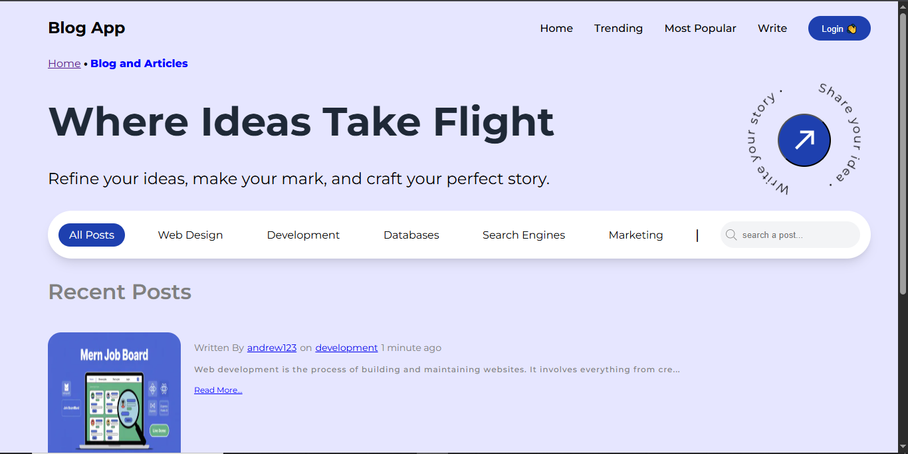

# 📝 Blog App

A full-stack blog platform built with the MERN stack (MongoDB, Express.js, React, Node.js). It includes user authentication, post creation, commenting, image uploading via ImageKit, and the ability to save and feature posts.

---

## 🚀 Tech Stack

### Frontend – React
- React 18
- Redux Toolkit + React Redux
- React Router DOM (v7)
- ImageKit React SDK
- React Activity (Spinners)

### Backend – Node.js + Express
- Express.js 5
- MongoDB + Mongoose
- JWT Authentication
- bcryptjs (Password Hashing)
- ImageKit SDK (for image handling)

---

## 🎯 Features

- User registration, login, logout
- JWT-based authentication with cookies
- Create, read, delete blog posts
- Feature a post and track its views
- Add and delete comments on posts
- Save and unsave posts
- Fetch posts with infinite scroll
- Rich text editor for post content
- Upload images via ImageKit
- User profile with saved posts
- Time-ago formatting for timestamps

---

## 🛠️ Installation & Setup

Follow these steps to run the project locally:

### 1. Clone the repository

```bash
git clone <repository-url>
cd <project-root>
````

---

### 2. Setup Frontend (React)

```bash
cd client
npm install
```

Then, create a `.env` file inside the `client` directory and add the required environment variables:

```env
VITE_IMAGEKIT_PUBLIC_KEY=your_public_key
VITE_IMAGEKIT_URL_ENDPOINT=your_url_endpoint
VITE_API_BASE_URL=http://localhost:5000/api
```

To run the frontend:

```bash
npm run dev
```

---

### 3. Setup Backend (Node.js)

```bash
cd server
npm install
```

Then, create a `.env` file inside the `server` directory and add the following variables:

```env
PORT=5000
MONGO_URI=your_mongodb_connection_string
JWT_SECRET=your_jwt_secret
IMAGEKIT_PUBLIC_KEY=your_imagekit_public_key
IMAGEKIT_PRIVATE_KEY=your_imagekit_private_key
IMAGEKIT_URL_ENDPOINT=your_url_endpoint
```

To run the backend:

```bash
npm run dev
```

---

## 📸 Screenshot

Here is a preview of the homepage:



